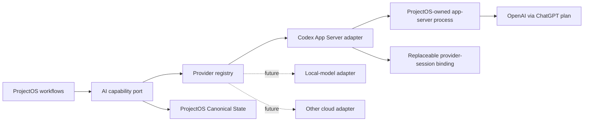

# ProjectOS AI Provider Architecture Spine

## Paradigm

**Ports and Adapters with capability negotiation.** ProjectOS domain workflows depend on a narrow, provider-neutral AI port. Each cloud service or local runtime is an adapter that translates provider mechanics into ProjectOS-owned requests, events, results, errors, usage state, and session lifecycle.

## Inherited invariants

- ProjectOS is local-first and owns Canonical State, Conversations, Change Proposals, Rationale, Provenance, exports, and validation records.
- AI output never becomes Canonical State without explicit user review.
- Browsing and local mutation never initiate provider work.
- Only user-approved context crosses a provider boundary.
- ProjectOS hosts neither inference nor provider billing.
- Additional cloud providers and local models are intended extensions.

## Architecture decisions

### AD-1 — Domain-facing AI port `[ADOPTED]`

- **Binds:** every ProjectOS workflow that requests AI work.
- **Prevents:** Codex request types, thread semantics, authentication, or quota concepts spreading through domain and UI modules.
- **Rule:** workflows express ProjectOS jobs—grounded generation, structured Change Proposal production, streaming, cancellation, status, and session cleanup—using ProjectOS-owned types only.

### AD-2 — Capability-aware provider registry `[ADOPTED]`

- **Binds:** provider selection, setup, settings contributions, and feature availability.
- **Prevents:** a lowest-common-denominator interface or assumptions that all providers support the Codex feature set.
- **Rule:** capabilities are typed claims scoped to the active adapter instance, runtime version, account, and selected model/configuration. Each claim is `supported`, `unsupported`, `temporarily unavailable`, or `unknown` and is re-evaluated at dispatch. Every ProjectOS job declares mandatory capabilities and explicit user-visible degradations; capability changes never silently alter locality, billing, privacy, or structured-output guarantees.

### AD-3 — Canonical Conversation ownership `[ADOPTED]`

- **Binds:** Conversation persistence, export, restore, provider switching, and deletion.
- **Prevents:** a Codex thread or another provider session becoming the authoritative Conversation record.
- **Rule:** ProjectOS assigns the canonical Conversation ID and stores provider session IDs as replaceable bindings keyed by adapter. Portable exports exclude bindings, provider session identifiers, authentication state, runtime caches, and unsanitized diagnostics. Restore performs no provider action and never reattaches a provider session; resumed AI work creates a new binding. Every restore creates a new Project copy and atomically remaps all Project-owned IDs through one restore map while preserving relationships and Provenance; original IDs remain import-provenance metadata only.

### AD-4 — Initial Codex process boundary `[ADOPTED]`

- **Binds:** the validation adapter transport and process lifecycle.
- **Prevents:** coupling ProjectOS to private ChatGPT desktop processes, undocumented local ports, or global daemon state.
- **Rule:** ProjectOS starts and supervises its own compatible `codex app-server` child process over stdio JSON-RPC, supplies a ProjectOS-scoped `CODEX_HOME`, performs the documented initialize handshake, and terminates or restarts only the process it owns. Validation may require an installed Codex CLI. Profile isolation and multi-instance ownership follow AD-13.

### AD-5 — Runtime-owned authentication `[ADOPTED]`

- **Binds:** ChatGPT login, token refresh, logout, account/plan display, and authentication failures.
- **Prevents:** ProjectOS becoming an OAuth client that reads or persists ChatGPT tokens.
- **Rule:** the ProjectOS-scoped Codex configuration forces ChatGPT login and macOS keyring credential storage. The adapter uses managed `account/login/start` with `type: chatgpt`, opens the returned browser URL, and observes account notifications. Codex owns tokens and refresh. ProjectOS stores only non-secret adapter status and never includes authentication material in logs, projects, or exports; setup fails closed if secure storage is unavailable. `chatgptDeviceCode` may appear only as a version- and availability-gated recovery capability and never exposes tokens to ProjectOS.

### AD-6 — ProjectOS-owned structured output `[ADOPTED]`

- **Binds:** Change Proposal generation and validation.
- **Prevents:** provider-native response shapes from entering Canonical State or malformed model output bypassing review.
- **Rule:** ProjectOS defines the Change Proposal schema. The Codex adapter supplies it as the per-turn `outputSchema`, parses the completed result, validates it again against the ProjectOS schema, and returns a normalized result to the ProjectOS job coordinator. Only the coordinator may persist a pending Change Proposal. Other adapters may use different structured-output mechanisms but return the same ProjectOS result type.

### AD-7 — Normalized event and error model `[ADOPTED]`

- **Binds:** streaming UI, cancellation, retries, offline behavior, notifications, and diagnostics.
- **Prevents:** screens branching on vendor error strings or App Server event names.
- **Rule:** every normalized event carries a durable ProjectOS job ID, provider-instance ID, and deterministic ordering information. A shared reducer yields exactly one terminal outcome; duplicate, late, reordered, cross-job, and post-terminal events cannot change it. Cancellation remains a request until acknowledged or superseded by completion. Errors use an envelope containing category, retryability, optional provider code and HTTP status, optional limit/reset state, user remedy, and a sanitized diagnostic reference. Specific authentication, runtime, network, allowance, or rate categories require explicit provider signals; otherwise classification is `providerFailed` or `unknown` rather than inference from vendor strings. Raw payloads remain memory-only. Persisted diagnostics allowlist normalized codes, runtime version, timestamps, and ProjectOS correlation IDs while excluding credentials, account IDs, Project content, prompts/results, and local paths.

### AD-8 — Restrictive execution envelope `[ADOPTED]`

- **Binds:** every Codex thread and turn created for ProjectOS.
- **Prevents:** a coding agent from modifying unrelated files, running consequential commands, or broadening selected context.
- **Rule:** every ProjectOS Codex thread uses explicit restricted read access. Readable roots contain only a disposable ProjectOS working directory and runtime-required platform roots recorded for the exact supported Codex build; no Project, home, or unrelated root is readable and there are no writable roots. Product jobs use `approvalPolicy: never` and `experimentalApi: false`. User instructions, MCP servers, apps, plugins, skills, connectors, and dynamic tools are isolated; returned `instructionSources` must match an allowlist. App Server's internal controls are defense in depth and are not assumed to disable built-in command or web tools. Production adoption requires either a documented stable tool-disable mechanism or an external OS containment boundary that prevents unrelated read, mutation, and transmission before any side effect, including under hostile selected content. Any command, file-change, web-search, tool-call, or permission-request event fails the product-fit gate. If prevention cannot be demonstrated, ProjectOS rejects the Codex adapter rather than relying on detection.

### AD-9 — Provider-session lifecycle parity `[ADOPTED]`

- **Binds:** create, resume, export, restore, archive, and permanent Project deletion.
- **Prevents:** orphaned App Server rollout logs contradicting ProjectOS ownership claims.
- **Rule:** provider-session creation first establishes a durable lifecycle obligation. Active bindings may be replaced, but a minimal application-level `ProviderCleanupOutbox` retains only adapter ID, ProjectOS provider-profile ID, non-secret authentication-context fingerprint, opaque provider-session ID, lifecycle state, retry count, and timestamps until deletion is confirmed or already absent. Transitions across `createIntent`, `bound`, `retired`, `deletePending`, `reauthRequired`, `confirmed`, and `absent` are crash-recoverable and idempotent; startup reconciliation resumes incomplete work. Logout or account switching first attempts cleanup for that authentication context; incomplete cleanup requires explicit residual-data disclosure and later reauthentication to the matching context. Local Project erasure removes Project content and ordinary bindings but may leave an outbox receipt. “Project deleted” and “provider cleanup complete” are separate outcomes. Cleanup never resends Project content, and ProjectOS never claims to delete independent provider retention, backups, or exports.

### AD-10 — Versioned protocol boundary `[ADOPTED]`

- **Binds:** App Server startup, schema compatibility, upgrades, and contract tests.
- **Prevents:** silent breakage when an installed Codex version changes its protocol.
- **Rule:** the Codex adapter supports only exact Codex builds validated by contract tests and recorded with generated-schema digests. It uses an enumerated documented RPC subset with `experimentalApi: false`; startup fails closed when the binary, schema, or required method set differs. A broader supported range may be introduced only after compatibility is demonstrated. Codex protocol types stay inside the adapter.

### AD-11 — Adapter proof through contract tests `[ADOPTED]`

- **Binds:** implementation acceptance for the provider abstraction.
- **Prevents:** an interface that is nominally generic but only executable by Codex.
- **Rule:** one reusable contract-test suite runs against a deterministic fake adapter and the Codex adapter where applicable. The fake adapter must exercise generation, structured proposals, streaming, cancellation, capability absence, normalized errors, session binding, and cleanup without importing Codex types.

### AD-12 — Application-owned mutation and idempotency `[ADOPTED]`

- **Binds:** provider-job dispatch, result persistence, retries, and Canonical State mutation.
- **Prevents:** adapters writing domain state, duplicate completions creating duplicate proposals, or stale output mutating a newer Project revision.
- **Rule:** adapters cannot access Canonical State, Conversation, Change Proposal, export, or deletion repositories; they return normalized events, results, and opaque session handles only. One ProjectOS job coordinator owns proposal persistence. Every job carries a durable job ID, Conversation ID, and expected Canonical-State revision, and completion is idempotent. Provider output may create only a pending Change Proposal; accept, edit, and reject remain separate user-authorized application transactions.

### AD-13 — Isolated Codex runtime profile `[ADOPTED]`

- **Binds:** `CODEX_HOME`, environment, configuration, authentication, instructions, sessions, logs, and concurrent application instances.
- **Prevents:** ProjectOS inheriting or modifying the user's normal Codex account, sessions, extensions, or configuration.
- **Rule:** the Codex child receives a ProjectOS-dedicated, permission-restricted state/configuration root and scrubbed allowlisted environment. It must not load, list, modify, delete, log out, or depend on the user's default Codex profile. Login, logout, account switching, thread deletion, and process termination affect only the ProjectOS profile. Concurrent ProjectOS instances coordinate exclusive ownership of that profile or use isolated instance profiles.

## Minimal seed

| Unit | Ownership |
|---|---|
| `AiProviderPort` | ProjectOS request/result and lifecycle contract |
| `ProviderRegistry` | Adapter discovery, selection, capabilities, and settings contributions |
| `ProviderSessionBinding` | Replaceable Conversation-to-provider-session association |
| `CodexAppServerAdapter` | Codex process, protocol, auth, account, allowance, thread, turn, and error translation |
| `FakeProviderAdapter` | Deterministic contract proof and failure simulation |
| `ProviderJobCoordinator` | Durable job identity, event reduction, idempotent proposal persistence, and revision checks |
| `ProviderCleanupOutbox` | Minimal crash-safe provider-session lifecycle and deletion retry records outside Project content |
| `CodexRuntimeProfile` | Isolated state, configuration, environment, authentication, and process ownership |
| `ProviderAuthContext` | Non-secret identity for matching session obligations to the provider profile/account context required for cleanup |
| ProjectOS persistence | Canonical Conversations, proposals, artifacts, and sanitized adapter metadata |

Names are illustrative seed; compliant code owns final module and type names.

## Current platform facts

- [Codex authentication](https://developers.openai.com/codex/auth) distinguishes ChatGPT subscription access from API-key usage-based access and documents Codex-owned browser login and token caching.
- [Codex App Server](https://developers.openai.com/codex/app-server) documents rich-client integration, stdio JSON-RPC, managed account login, plan and rate-limit state, per-turn output schemas, restrictive sandbox inputs, persisted threads, and `thread/delete`.

## Deferred

- Commercial runtime distribution: require an installed Codex CLI or bundle and update a pinned runtime. Revisit after the validation spike and before Mac App Store architecture.
- The first local-model adapter and runtime. Revisit only after the Codex-backed continuity loop reaches its validation gate.
- Cross-provider continuation of an in-flight provider-native session. Canonical ProjectOS history remains portable; provider-native hidden context does not need to be.
- Provider-specific model routing and automatic fallback. No silent fallback may change billing, privacy, quality, or execution locality.
- App Server root-thread ephemerality. Current documented root threads are persisted; use explicit deletion unless a supported non-persistent root-thread contract is verified.
