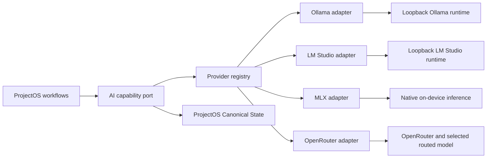

# ProjectOS AI Provider Architecture Spine

## Paradigm

**Ports and Adapters with capability negotiation.** ProjectOS domain workflows depend on a narrow, provider-neutral AI port. Ollama, LM Studio, and MLX are first-class local MVP adapters. OpenRouter is the only optional external adapter. Every adapter translates its mechanics into ProjectOS-owned requests, events, results, errors, model/runtime state, and optional session lifecycle.

## Inherited invariants

- ProjectOS is local-first and owns Canonical State, Conversations, Change Proposals, Rationale, Provenance, exports, and validation records.
- AI output never becomes Canonical State without explicit user review.
- Browsing, local mutation, import, extraction, and navigation never initiate inference.
- Only explicitly selected context enters a provider operation.
- ProjectOS hosts neither external inference nor provider billing.
- Local inference is the default category; external OpenRouter processing is optional and explicit.
- Adapter or model changes never silently change accepted Canonical State.

## Architecture decisions

### AD-1 — Domain-facing AI port `[ADOPTED]`

- **Binds:** every ProjectOS workflow that requests AI work.
- **Prevents:** runtime protocols, model-server shapes, credentials, or routing concepts spreading through domain and UI modules.
- **Rule:** workflows express ProjectOS jobs—grounded generation, structured Change Proposal production, streaming, cancellation, status, and optional session cleanup—using ProjectOS-owned types only.

### AD-2 — Capability-aware provider registry `[ADOPTED]`

- **Binds:** adapter discovery, explicit selection, setup, settings contributions, and feature availability.
- **Prevents:** a lowest-common-denominator interface or assumptions that every runtime/model has the same context, structured-output, streaming, cancellation, or resource behavior.
- **Rule:** capabilities are typed claims scoped to the active adapter instance, runtime version, model, and configuration. Each claim is `supported`, `unsupported`, `temporarily unavailable`, or `unknown` and is re-evaluated at dispatch. Every job declares mandatory capabilities and an explicit user-visible degradation.

### AD-3 — Canonical Conversation ownership `[ADOPTED]`

- **Binds:** Conversation persistence, export, restore, adapter switching, and deletion.
- **Prevents:** a runtime or routed model becoming the authority for project history.
- **Rule:** ProjectOS assigns the canonical Conversation ID and transcript. Provider session IDs, when an adapter actually uses them, are optional replaceable bindings. Portable exports exclude bindings, credentials, runtime caches, and unsanitized diagnostics. Restore performs no provider action and creates no binding.

### AD-4 — First-class local adapter family `[ADOPTED]`

- **Binds:** production local inference and shared local setup behavior.
- **Prevents:** one local runtime becoming the shape of ProjectOS or a hidden preferred fallback.
- **Rule:** Ollama, LM Studio, and MLX implement a shared local-inference contract through separate adapters. All are first-class MVP choices. Discovery may suggest an available adapter, but activation and model selection require an explicit user decision. ProjectOS never silently switches among local adapters or models.

### AD-5 — Loopback boundary for Ollama and LM Studio `[ADOPTED]`

- **Binds:** server discovery, health, model enumeration, generation, and runtime failures.
- **Prevents:** a remote endpoint being presented as local processing.
- **Rule:** validation-build Ollama and LM Studio adapters connect only to supported loopback endpoints. Non-loopback endpoints fail setup with an explicit unsupported-boundary result. ProjectOS does not own or silently install, start, stop, update, or download models through these user-managed runtimes.

### AD-6 — Native MLX inference boundary `[ADOPTED]`

- **Binds:** on-device model loading, generation, cancellation, resource readiness, and ProjectOS-managed cache behavior.
- **Prevents:** MLX implementation details leaking into domain workflows or being treated like a loopback server.
- **Rule:** MLX runs through a native on-device adapter. The exact library boundary, supported model formats, packaging, storage, and minimum hardware are resolved during implementation architecture and recorded as adapter compatibility criteria, not through another feasibility spike.

### AD-7 — OpenRouter external boundary and credential vault `[ADOPTED]`

- **Binds:** external setup, API authentication, routed-model selection, usage disclosure, and external failures.
- **Prevents:** provider secrets entering Project data or direct OpenAI/Anthropic integrations appearing as hidden alternatives.
- **Rule:** OpenRouter is the only MVP external adapter. Its API key is stored in macOS Keychain. ProjectOS persists only non-secret configuration and a Keychain reference outside Project data. The key is excluded from logs, diagnostics, exports, and ProjectOS-created backups. Direct OpenAI, Anthropic, and Codex adapters are not MVP fallbacks.

### AD-8 — ProjectOS-owned structured output `[ADOPTED]`

- **Binds:** Change Proposal generation and validation.
- **Prevents:** provider-native response shapes or malformed model output entering trusted state.
- **Rule:** ProjectOS defines the Change Proposal schema. An adapter may use native schema support, constrained generation, or another internal technique, but every completed result is parsed and validated again against the ProjectOS schema. Only the application job coordinator may persist a pending proposal. Partial, malformed, cancelled, or stale output never becomes a proposal.

### AD-9 — Normalized event, job, and error model `[ADOPTED]`

- **Binds:** streaming UI, cancellation, retries, readiness, notifications, and diagnostics.
- **Prevents:** screens branching on runtime strings or ambiguous event timing.
- **Rule:** every normalized event carries a durable ProjectOS job ID, adapter-instance ID, attempt, and deterministic ordering information. One reducer yields exactly one terminal outcome despite duplicates, retries, cancellation races, or stale completion. Errors distinguish local runtime/model/resource failures and OpenRouter credential/network/rate/quota/billing/service failures only when explicit evidence supports the category; otherwise they remain `providerFailed` or `unknown`.

### AD-10 — Generation-only adapter authority `[ADOPTED]`

- **Binds:** every provider operation initiated by ProjectOS.
- **Prevents:** local or external models becoming autonomous agents with filesystem, command, connector, web, or domain-repository access.
- **Rule:** adapters expose generation only. ProjectOS supplies selected context as data and exposes no tools, commands, filesystem access, web search, MCP servers, connectors, apps, plugins, skills, or domain repositories. Output can create only a pending proposal after validation.

### AD-11 — Explicit boundary, model, and no-fallback contract `[ADOPTED]`

- **Binds:** Context Preview, dispatch, retries, runtime/model changes, and external billing disclosure.
- **Prevents:** silent changes in locality, privacy, cost, model, or output quality.
- **Rule:** Context Preview names the adapter, model, local/external execution boundary, selected context, language, and known capability limitations. OpenRouter preview also names external processing and usage-based billing. A runtime, provider, or model change is explicit and never automatically resends, retries, or reinterprets prior work.

### AD-12 — Application-owned mutation and capability-aware lifecycle `[ADOPTED]`

- **Binds:** result persistence, retries, Canonical State mutation, export, restore, deletion, and optional provider sessions.
- **Prevents:** adapters writing domain state or sessionless adapters inheriting unnecessary cleanup machinery.
- **Rule:** adapters cannot access Canonical State, Conversation, Change Proposal, export, or deletion repositories. The application coordinator owns durable job identity, idempotent proposal persistence, and expected-revision checks. Provider cleanup obligations exist only when an adapter declares and uses a persistent provider session. Project deletion, OpenRouter credential removal, user-managed runtime/model removal, ProjectOS-managed MLX cache removal, and independent external retention are separate truthful outcomes.

### AD-13 — Versioned compatibility and contract proof `[ADOPTED]`

- **Binds:** runtime/model readiness, adapter upgrades, and implementation acceptance.
- **Prevents:** nominally generic adapters, unsupported model combinations, or silent compatibility drift.
- **Rule:** one reusable behavioral contract suite runs against deterministic fakes and every production adapter. Each adapter also has targeted integration tests for its runtime, model, resource, cancellation, output, and failure boundary. Supported versions/models and minimum hardware are recorded as production compatibility criteria. These tests are implementation acceptance, not another pre-product spike.

## Minimal seed

| Unit | Ownership |
|---|---|
| `AiProviderPort` | ProjectOS request, result, job, and lifecycle contract |
| `ProviderRegistry` | Adapter discovery, explicit selection, capabilities, models, and settings contributions |
| `LocalInferenceAdapter` | Shared local runtime/model contract |
| `OllamaAdapter` | Loopback Ollama health, models, generation, cancellation, and failures |
| `LMStudioAdapter` | Loopback LM Studio health, models, generation, cancellation, and failures |
| `MLXAdapter` | Native model loading, generation, cancellation, resources, and ProjectOS-managed caches |
| `OpenRouterAdapter` | Keychain-backed external generation, routed-model selection, usage, and failures |
| `ProviderJobCoordinator` | Durable job identity, event reduction, idempotent proposal persistence, and revision checks |
| `ProviderSessionBinding` | Optional replaceable binding for an adapter that actually uses persistent sessions |
| ProjectOS persistence | Canonical Conversations, proposals, artifacts, and sanitized non-secret adapter metadata |

Names are an illustrative seed; compliant production code owns final module and type names.

## Superseded Codex production direction

Epic 1 completed the Codex App Server validation path with `reject`. The former Codex process, managed ChatGPT authentication, exact App Server protocol, execution containment, isolated profile, and provider-session cleanup decisions remain preserved in `validation-spike.md`, Story 1.x specifications, the disposable harness, and retained evidence. They do not authorize or constrain the replacement production adapters except where their provider-neutral safety invariants were adopted above.

The architecture revision authorizes later local-first ProjectOS work without claiming that the Codex gate passed. Codex App Server, direct OpenAI, and direct Anthropic integrations are outside the MVP.

## Deferred

- Remote Ollama or LM Studio endpoints.
- Local runtimes other than Ollama, LM Studio, and MLX.
- Direct OpenAI, Anthropic, Codex, or other provider APIs.
- Automatic model routing or provider fallback.
- Cross-provider continuation of provider-native hidden session state.
- ProjectOS-hosted inference, provider billing, or project-content storage.
