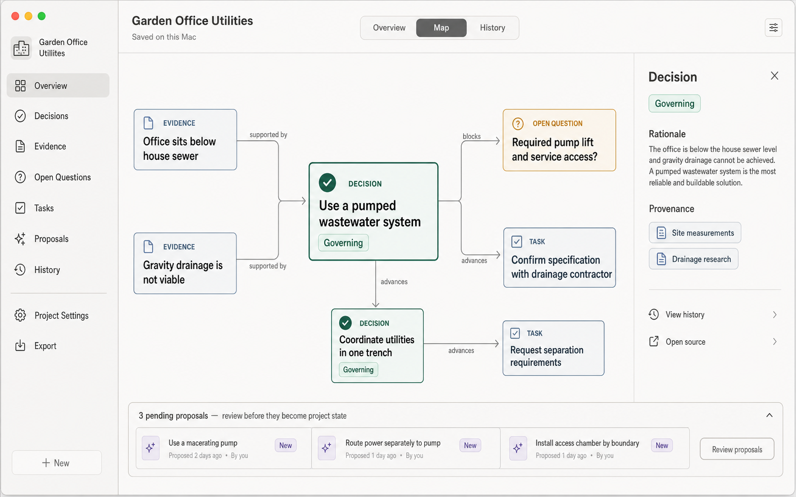

# Project Map Interaction Concept

## Purpose

The Project Map turns the artifact relationship graph from a passive visualization into an actionable semantic map. It helps a person understand how accepted project knowledge fits together, inspect why the project reached its current state, and continue meaningful work from the artifact or relationship that needs attention.

The Project Map complements the Project Overview:

- The Overview answers: **Where am I, and what matters now?**
- The Project Map answers: **How is project knowledge connected, why did it change, and where can I intervene?**

The Project Map is post-validation product direction. It does not expand the current personal validation build or replace validation of the core conversation, proposal-review, canonical-state, re-entry, and recovery loop.

## Authority and Lifecycle

This is a working UX companion during Discovery. Accepted decisions are recorded in the UX `.memlog.md`. At UX Finalize, behavioral decisions from this document must be distilled into `EXPERIENCE.md`, visual decisions into `DESIGN.md`, and the supporting visual promoted or replaced as appropriate. The UX spines win on conflict.

When implementation is scheduled, derive a focused implementation specification from the finalized UX contracts. Do not treat this working document as an architecture or data-model specification.

## Supporting Visual

The current mockup already demonstrates a first-class Map destination, selectable nodes, labeled relationships, an Artifact Inspector, governing status, provenance, history access, and pending proposals separated from accepted project state.

The mockup uses **Evidence** as a node type. The governing ProjectOS artifact vocabulary uses **Research**; a future revision should align the visual without changing the intent of those nodes.

## Experience Principles

### Selection reveals context; an explicit action starts work

Selecting a node or relationship is a local inspection action. It must not contact an AI provider or mutate Canonical State. Provider contact begins only after the person chooses an explicit conversational or agent action.

### Current accepted state is the default

The default map emphasizes accepted, governing, and unresolved current state. Historical, superseded, retired, rejected, and pending material remains inspectable but must not compete visually with current truth.

### The graph is a working surface, not a diagram

Every interactive element must support orientation, inspection, explanation, or meaningful action. Decorative relationships, unexplained visual encoding, and graph complexity without user value are excluded.

### Consequential changes remain governed

The Project Map must not bypass proposal review. Agent-generated corrections, supersessions, relationship changes, Topic splits or merges, and other consequential changes become persisted Change Proposals and affect Canonical State only after explicit acceptance.

## Information Architecture

Project Map is a first-class project destination alongside Overview and other primary project surfaces. It does not replace Overview as the normal re-entry surface.

Prominence may increase with project maturity. A new or lightly structured project can emphasize Overview and direct artifact navigation; a relationship-rich project can surface a compact map preview and a stronger entry into Project Map. The precise promotion threshold remains unresolved.

The surface contains:

1. **Map canvas** — accepted artifacts and typed relationships.
2. **Artifact Inspector** — current status, concise content, rationale, important relationships, provenance, history, and type-aware actions.
3. **Relationship Inspector** — relationship type, explanation, provenance, and relevant actions.
4. **Lenses and filters** — focused views over the same project state.
5. **Proposal layer** — proposed nodes and relationship changes that remain visibly separate from Canonical State.
6. **Context preview** — the project scope that will be supplied when an explicit agent action is started.

## Artifact Inspector

The Inspector opens without navigating away from the map and preserves the selected node's surrounding context. It presents current accepted information first and history on demand.

Every artifact uses a consistent Inspector structure:

1. Artifact type, title, and status.
2. Concise current content and why it matters.
3. Rationale or supporting context where applicable.
4. Important incoming and outgoing relationships.
5. Provenance and change history.
6. Actions meaningful for that artifact type.

| Artifact type | Primary Project Map actions |
|---|---|
| Topic | Start a Topic-grounded Conversation; inspect related work; edit; propose split, merge, or retirement |
| Decision | Discuss rationale; compare governing and superseded versions; challenge; reconsider |
| Open Question | Start a grounded Conversation; answer directly; inspect what it blocks |
| Research | Summarize; verify or update; inspect supported or contradicted Decisions |
| Task | Discuss blockers; inspect dependencies; complete or revise |
| Conversation | Resume where appropriate; start a focused follow-up; inspect resulting artifacts and proposals |

Actions that contact the provider must be distinguishable from local actions before activation.

## Relationship Interaction

Relationships are first-class inspectable elements rather than decorative lines.

Selecting a relationship opens the Relationship Inspector and explains:

- What the relationship means.
- Why the artifacts are connected.
- Where the relationship came from.
- Whether it is accepted, proposed, historical, or potentially stale.
- What would be affected if the relationship changed.

Relevant actions can include **Discuss relationship**, **Explain dependency**, **Inspect provenance**, and **Propose correction**.

Multi-selection supports comparison and synthesis across a deliberately chosen set of artifacts. Examples include comparing two Decisions, reconciling Topics, investigating a contradiction between Research and a Decision, or asking how several artifacts jointly affect an Open Question. The selected scope must be visible before an agent call begins.

## Reconsidering a Superseded Decision

Reconsideration is a primary Project Map flow:

1. Wouter reveals historical state or follows a supersession relationship.
2. He selects a superseded Decision.
3. The Artifact Inspector shows the original Decision, its rationale, the Decision that replaced it, why the change happened, and affected relationships.
4. Wouter chooses **Reconsider decision**.
5. ProjectOS previews the context that will be sent: the superseded Decision, the current governing Decision, their rationales and provenance, relevant changes since supersession, and affected dependencies.
6. Wouter explicitly starts a grounded Conversation.
7. The agent helps evaluate whether changed circumstances justify a different current direction.
8. Any resulting change is persisted as a Change Proposal and reviewed explicitly.

Reinstatement never silently toggles an old record back to governing. Acceptance creates a new governing version linked to both the historical Decision and the Decision it supersedes, preserving chronology and rationale.

## Graph Lenses and Complexity Management

The complete graph must not become the only way to understand the project. Project Map supports focused lenses such as:

- Current state.
- Unresolved work.
- Decision history.
- Provenance.
- Recent changes.
- A single Topic and its neighborhood.
- Pending proposals.

Selecting an artifact can enter **Focus mode**, emphasizing its immediate neighborhood while fading unrelated material. Layout should remain spatially stable during inspection and ordinary updates so the person can develop a reliable mental map. Automatic layout changes should be explainable, limited, and recoverable.

Historical comparison may show how relationships changed between Canonical-State versions. The precise time-comparison interaction remains to be designed.

## State Separation

The map must make these distinctions perceivable without relying on color alone:

- Governing versus superseded Decision.
- Current versus historical or retired artifact.
- Accepted Canonical State versus pending Change Proposal.
- Resolved versus unresolved Open Question.
- Available provenance versus missing provenance.
- Local inspection versus provider-contacting action.
- Online versus offline capabilities.

Pending nodes or relationships may appear as an optional proposal layer, but they must never look accepted before approval. Rejected proposals remain available through proposal history rather than appearing in the default map.

## Agent Context and Trust Boundary

Before a graph-initiated agent call, ProjectOS shows a concise context preview containing:

- The selected artifact or relationship.
- Any deliberately included neighboring artifacts.
- Relevant rationale, provenance, and current status.
- The configured AI provider.

The person can inspect and, where appropriate, narrow the selected scope. Starting the Conversation is the explicit authorization to transmit that context. Selection, filtering, history inspection, and ordinary graph navigation remain local and useful offline.

When offline, provider actions are visibly unavailable. ProjectOS must not silently queue an agent call for later transmission.

## Accessibility and Input

Project Map must provide equivalent understanding and actions without requiring pointer-based spatial navigation.

- Every node, relationship, control, and status is keyboard reachable.
- Focus order is predictable and does not follow arbitrary screen coordinates.
- A structured outline or relationship-list view provides equivalent content and actions.
- Screen-reader labels include artifact type, title, status, and relationship meaning.
- Status does not depend on color alone.
- Zoom and pan do not trap keyboard or assistive-technology users.
- Focus mode and reduced-complexity lenses support cognitive accessibility.
- Purposeful motion may clarify transitions, but reduced-motion preferences are respected.

## Continuity Between Map and Conversation

Starting a Conversation preserves the originating selection and map context. The Conversation identifies which artifact or relationship grounded it. Returning to Project Map restores the prior lens, viewport, and selection when practical.

Artifacts and Change Proposals produced by the Conversation remain linked to their provenance. After acceptance, the map highlights the resulting change without unexpectedly rearranging the entire canvas.

## Initial Validation Sequence

Before building the complete Project Map, prototype and test three interactions:

1. **Topic → grounded Conversation** — can Wouter continue work without restating known context?
2. **Superseded Decision → reconsideration** — can Wouter understand why direction changed and safely explore reversal?
3. **Relationship → explain or discuss** — does edge interaction add understanding beyond opening the two connected artifacts?

Evidence should assess:

- Time from entering Project Map to a meaningful next action.
- Whether Wouter correctly distinguishes governing, superseded, historical, and proposed state.
- Whether graph-started Conversations require less manual context restatement.
- Whether the Inspector provides enough context before provider contact.
- Whether the graph remains useful after novelty and as project complexity grows.
- Whether ordinary artifact lists or Overview remain faster for simple tasks.

## Open Design Questions

- What exact navigation position and shortcut should Project Map receive?
- When should a compact map preview become prominent on Overview?
- Which relationship types are user-authored, agent-proposed, or derived?
- What neighborhood is included by default in an agent context preview?
- How are conflicting, weak, or potentially stale relationships represented?
- How should time comparison work without destabilizing the current-state mental map?
- How should Conversation nodes distinguish resume, follow-up, and provenance-only behavior?
- Which proposal states belong in the optional map layer?

These questions should be resolved during continued UX Discovery. They do not block preserving the accepted product direction.
